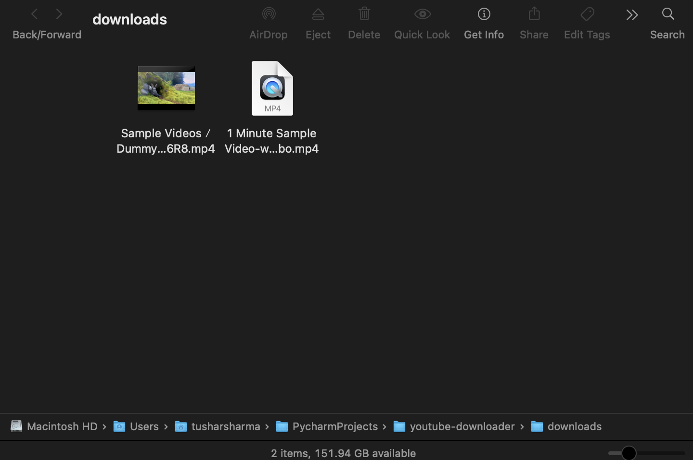

# YouTube Video Downloader (Python)

A Python script that downloads YouTube videos in the **highest resolution**  
and saves them in a QuickTime-compatible `.mp4` format.  

---

## 🚀 Features

- Downloads **video + audio merged** in `.mp4` format
- Automatically creates a `downloads/` folder
- Unique filenames → no overwriting
- Works on **macOS, Windows, and Linux**
- Beginner-friendly Python + CLI project

---

## 🖥️ Example

### Before


### After


---

## ⚡ Usage
**Clone the repository:**
```bash
git clone git@github.com:alphatushar/youtube-downloader.git
```
---

### Services
- Python CLI script for downloading YouTube videos
- Uses yt-dlp for downloads
- Saves files to local Downloads folder

---

## Author
Tushar Sharma